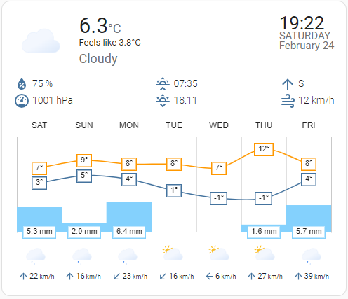
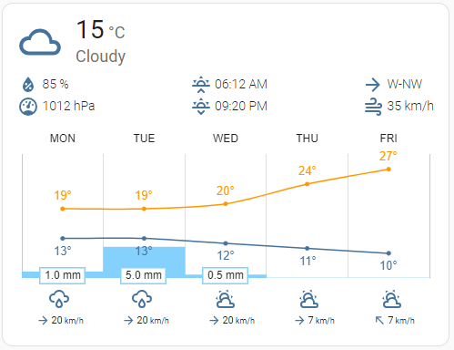
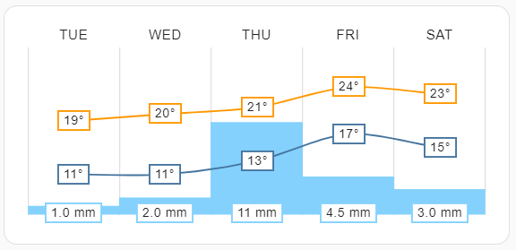

# Forcast Weather Chart Card

Fork maintained by me. Forked from mlamberts78 and w4mhi. Credits for these 2!

This card is focused on a full-screen weather dashboard experience (tablet-friendly), with:

- large current conditions
- optional time/day/date block
- forecast chart with multiple styles
- configurable forecast icon and wind rows
- extensive size and visibility controls in the editor

The Card is meant to be used as standalone wether display on tablet. The Focus is to display Clock, Date, Big forcast for 2 Days and next hours/days. It's highly adjustable in size and display.
I'm using it myself as 12 Hour forcast and 6 Days Forcast (with 2 days offset)

[](https://github.com/hacs/integration)
[](https://github.com/mstapelfeldt/weather-chart-card/releases/latest)


## Installation

### HACS

This card is available in HACS (Home Assistant Community Store).

If needed, add it as a custom repository:

- URL: `https://github.com/mstapelfeldt/weather-chart-card`
- Category: `Dashboard`

## Quick Start

```yaml
type: custom:weather-chart-card
entity: weather.weather_home
```

## Editor Navigation (Where to Find Settings)

The visual editor is split into five pages:

1. `Card`
2. `Main`
3. `Forecast`
4. `Units`
5. `Alternate entities`

Use this map to quickly locate options.

### Card Page

- `entity`
- `hide_title`
- `title`
- `locale`
- `timezone`
- `sun_city` / `sun_latitude` / `sun_longitude` (via city validator)
- `animated_icons`
- `icon_style`

### Main Page

- visibility toggles for main/current/attributes/time sections
- attribute toggles (humidity, pressure, UV, wind, dew point, visibility, and more)
- time options (`show_time_seconds`, `show_hour_leading_zero`, `show_day`, `show_date`, `use_12hour_format`)
- `autoscroll`
- size controls:
  - `time_size`, `day_date_size`, `current_temp_size`
  - `icons_size`, `main_icon_size`
  - `main_headline_size`, `current_condition_size`, `feels_like_size`
  - `attributes_font_size`, `attributes_icon_size`

### Forecast Page

- forecast mode and display:
  - `forecast.type` (`daily` or `hourly`)
  - `show_forecast_toggle`
  - `forecast.auto_rotate`
  - `forecast.style`
  - `forecast.condition_icons`
  - `forecast.show_wind_forecast`
  - `forecast.round_temp`
  - `forecast.disable_animation`
- precipitation:
  - `forecast.precipitation_type`
  - `forecast.show_probability`
  - `forecast.precip_bar_size`
- chart sizing/text:
  - `forecast.labels_font_size`
  - `forecast.chart_text_size`
  - `forecast.chart_height`
  - `forecast.chart_icon_size`
- forecast range:
  - `forecast.number_of_forecasts`
  - `forecast.forecast_start_offset`
- gradient and thresholds:
  - `forecast.use_color_thresholds`
  - `forecast.gradient_mode`
  - `forecast.gradient_preset`

### Units Page

- `units.temperature`
- `units.pressure`
- `units.speed`

### Alternate Entities Page

- `temp`
- `press`
- `humid`
- `uv`
- `winddir`
- `windspeed`
- `feels_like`
- `dew_point`
- `wind_gust_speed`
- `visibility_entity`
- `description`

## Forecast Count and Offset Behavior

Displayed points are limited by provider data and offset.

Effective count:

`visible = min(number_of_forecasts, available - forecast_start_offset)`

Example:

- `number_of_forecasts = 8`
- `forecast_start_offset = 2`
- `available = 8`
- result: `6` visible

If `number_of_forecasts = 0`, automatic mode is used (card width-based) but still limited by `available - offset`.

## YAML Option Reference

### Root Options

| Key | Type | Default | Editor Page | Description |
| --- | --- | --- | --- | --- |
| `type` | string | required | YAML only | Must be `custom:weather-chart-card`. |
| `entity` | string | required | Card | Weather entity. |
| `title` | string | `Weather` | Card | Card title. |
| `hide_title` | boolean | `false` | Card | Hide title row. |
| `locale` | string | HA default | Card | Translation locale. |
| `timezone` | string | HA default | Card | Timezone override for chart/time labels. |
| `animated_icons` | boolean | `true` | Card | Enable animated icons. |
| `icon_style` | string | `style1` | Card | Animated icon set (`style1`, `style2`). |
| `show_main` | boolean | `true` | Main | Show main section. |
| `show_main_forecast` | boolean | `false` | Main | Show tomorrow/day-after blocks in main area. |
| `show_temperature` | boolean | `true` | Main | Show current temperature. |
| `show_current_condition` | boolean | `true` | Main | Show current condition text. |
| `show_attributes` | boolean | `true` | Main | Show attributes row. |
| `show_time` | boolean | `false` | Main | Show clock block. |
| `show_time_seconds` | boolean | `false` | Main | Show seconds in clock. |
| `show_hour_leading_zero` | boolean | `true` | Main | Leading zero for hour. |
| `show_day` | boolean | `false` | Main | Show weekday. |
| `show_date` | boolean | `false` | Main | Show date. |
| `show_humidity` | boolean | `true` | Main | Show humidity attribute. |
| `show_pressure` | boolean | `true` | Main | Show pressure attribute. |
| `show_sun` | boolean | `true` | Main | Show sunrise/sunset. |
| `show_uv` | boolean | `true` | Main | Show UV index. |
| `show_wind_direction` | boolean | `true` | Main | Show wind direction. |
| `show_wind_speed` | boolean | `true` | Main | Show wind speed. |
| `show_feels_like` | boolean | `false` | Main | Show feels-like line (and affects main forecast text line). |
| `show_dew_point` | boolean | `false` | Main | Show dew point. |
| `show_wind_gust_speed` | boolean | `false` | Main | Show wind gust speed. |
| `show_visibility` | boolean | `false` | Main | Show visibility. |
| `show_description` | boolean | `false` | Main | Show weather description. |
| `show_last_changed` | boolean | `false` | Main | Show last-updated text. |
| `show_forecast_toggle` | boolean | `false` | Forecast | Show daily/hourly switch button on card. |
| `use_12hour_format` | boolean | `false` | Main | 12h clock display. |
| `autoscroll` | boolean | `false` | Main | Shift chart forward over time. |
| `icons_size` | number | `30` | Main | Daily icon size. |
| `main_icon_size` | number | `150` | Main | Main weather icon size. |
| `current_temp_size` | number | `35` | Main | Current temperature font size. |
| `main_headline_size` | number | `12` | Main | Main headline font size. |
| `current_condition_size` | number | `18` | Main | Current condition font size. |
| `feels_like_size` | number | `13` | Main | Feels-like text font size. |
| `attributes_font_size` | number | `14` | Main | Attributes text size. |
| `attributes_icon_size` | number | `16` | Main | Attributes icon size. |
| `time_size` | number | `26` | Main | Time font size. |
| `day_date_size` | number | `15` | Main | Date/day font size. |
| `forecast` | object | see below | Forecast | Forecast/chart configuration group. |
| `units` | object | inherit HA | Units | Unit conversion configuration. |

### Forecast Object (`forecast.*`)

| Key | Type | Default | Editor Page | Description |
| --- | --- | --- | --- | --- |
| `type` | string | `daily` | Forecast | Forecast mode: `daily` or `hourly`. |
| `auto_rotate` | number | `0` | Forecast | Auto toggle interval in minutes (`0` off). |
| `style` | string | `style2` | Forecast | Chart style (`style1`, `style2`, `style3`). |
| `condition_icons` | boolean | `true` | Forecast | Show condition icon row. |
| `show_wind_forecast` | boolean | `true` | Forecast | Show wind row below chart. |
| `round_temp` | boolean | `false` | Forecast | Round temperatures before display. |
| `disable_animation` | boolean | `false` | Forecast | Disable chart animations. |
| `precipitation_type` | string | `rainfall` | Forecast | `rainfall` or `probability`. |
| `show_probability` | boolean | `false` | Forecast | Show probability labels in rainfall mode. |
| `precip_bar_size` | number | `100` | Forecast | Precipitation bar thickness percentage. |
| `labels_font_size` | number | `11` | Forecast | Label font size. |
| `chart_text_size` | number | `11` | Forecast | Chart text and value font size. |
| `chart_height` | number | `180` | Forecast | Chart height in px. |
| `chart_icon_size` | number | `30` | Forecast | Condition/wind icon size in forecast area. |
| `number_of_forecasts` | number | `0` | Forecast | Number of items to display (`0` auto). |
| `forecast_start_offset` | number | `0` | Forecast | Start index for visible forecasts (`0` today/next item). |
| `use_color_thresholds` | boolean | `true` | Forecast | Use threshold-based temperature colors. |
| `gradient_mode` | string | `classic` | Forecast | `classic`, `climate_preset`, or `adaptive`. |
| `gradient_preset` | string | `temperate` | Forecast | Preset range for climate-based gradients. |
| `show_date_labels` | boolean | `true` | YAML only | Show date labels for daily charts. |
| `temperature1_color` | string | `rgba(255, 152, 0, 1.0)` | YAML only | Temperature line 1 color (classic mode). |
| `temperature2_color` | string | `rgba(68, 115, 158, 1.0)` | YAML only | Temperature line 2 color (classic mode). |
| `precipitation_color` | string | `rgba(132, 209, 253, 1.0)` | YAML only | Precipitation bar color. |
| `chart_datetime_color` | string | theme text | YAML only | X-axis label color override. |
| `chart_text_color` | string | auto/theme | YAML only | Value text color override. |

### Units Object (`units.*`)

| Key | Options |
| --- | --- |
| `temperature` | `C`, `F` |
| `pressure` | `hPa`, `mmHg`, `inHg` |
| `speed` | `km/h`, `m/s`, `mph`, `kn`, `Bft` |

## Custom Icons

Custom icon packs should be SVG files named like the built-in weather condition mappings.

Reference mapping:

- [src/const.js](src/const.js)

If needed, use your own base path via YAML `icons`.

## Examples

### Time and Date Focus



```yaml
type: custom:weather-chart-card
entity: weather.weather_home
show_time: true
show_day: true
show_date: true
animated_icons: true
icon_style: style1
```

### Style 2 Chart



```yaml
type: custom:weather-chart-card
entity: weather.my_home
forecast:
  style: style2
```

### Chart Only



```yaml
type: custom:weather-chart-card
entity: weather.my_home
show_main: false
show_attributes: false
forecast:
  condition_icons: false
  show_wind_forecast: false
```

### Fixed Count with Offset

```yaml
type: custom:weather-chart-card
entity: weather.openweathermap
forecast:
  number_of_forecasts: 8
  forecast_start_offset: 3
```

## Supported Languages

| Language | Locale |
| --- | --- |
| Bulgarian | `bg` |
| Catalan | `ca` |
| Czech | `cs` |
| Danish | `da` |
| Dutch | `nl` |
| English | `en` |
| Finnish | `fi` |
| French | `fr` |
| German | `de` |
| Greek | `el` |
| Hungarian | `hu` |
| Italian | `it` |
| Lithuanian | `lt` |
| Norwegian | `no` |
| Polish | `pl` |
| Portuguese | `pt` |
| Romanian | `ro` |
| Russian | `ru` |
| Slovak | `sk` |
| Spanish | `es` |
| Swedish | `sv` |
| Ukrainian | `uk` |
| Korean | `ko` |
